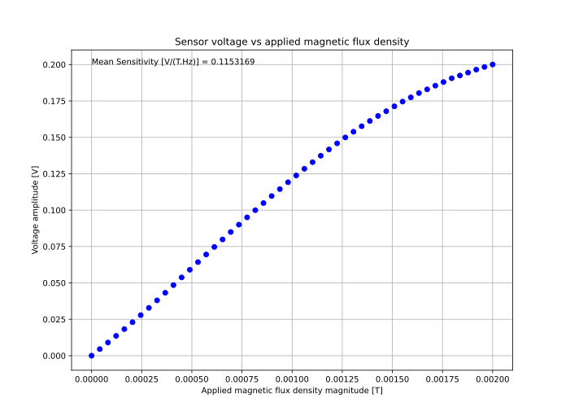
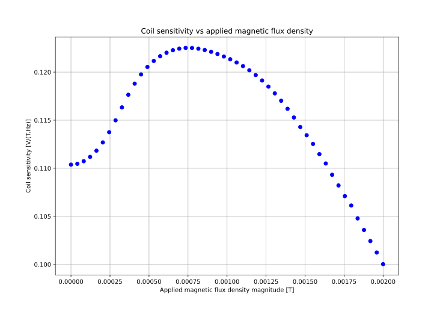
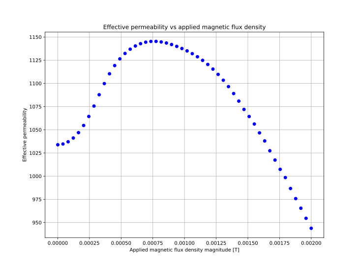
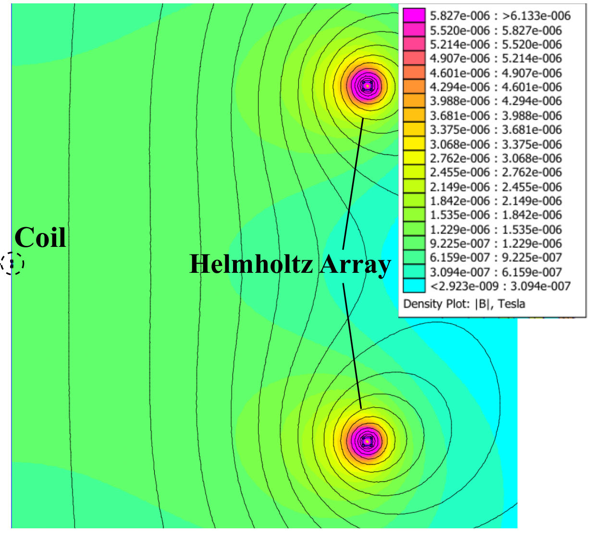

# pywinding
A simulation toolkit for the design and evaluation of induction microcoils using pyFEMM and Finite Element Method Magnetics ([FEMM](https://www.femm.info/wiki/HomePage)).

[](https://doi.org/10.5281/zenodo.15705727)

## Overview

This software toolkit simplifies the design and simulation of induction microcoils. The toolkit leverages the pyFEMM interface of the Finite Element Method Magnetics software (https://www.femm.info/wiki/HomePage, https://www.femm.info/wiki/pyfemm) to allow users to rapidly characterise the magnetic and electrical characteristics of induction microcoils containing permeable magnetic cores. The effect of shape anisotropy of the magnetic material is calculated to yield an *effective permeability* of the magnetic core.

Given a set of user defined coil geometry and simulation parameters the toolkit will:
1. Calculate the remaining mechanical parameters of the coil
2. Build the coil geometry and build a virtual Helmholtz array with which to apply the stimulus field to the coil
3. Sweep the coil with a set of magnetic flux densities and record the coil's voltage and magnetic response
5. Extract the electrical parameters of the coil, Resistance (Ohms) and Inductance (Henries)
6. Print and plot the results on-screen
7. Save the results to a .mat file


## Installation

Ensure the FEMM 4.2 software package (available at https://www.femm.info/wiki/HomePage) is installed on your system in the default installation directory `C:\femm42`.

Install the latest version of pywinding from PyPi with:
```python
python -m pip install pywinding
```
Dependancies are automatically installed.

## Getting started
Examples are available in the ```tests``` folder of the package. These can be executed as python scripts:
e.g.:
```bash
python test_microcoil.py
```
A step-by-step explanation of how the example is executed is explained in the next section.

##  Usage (command-line)

The pywinding tool can be used directly from the Python interpreter. 

From the interpreter import the pywinding classes for defining the geometry of a coil and the testbench for which to evaluate the coil's characteristics:
```python
>>> from pywinding import Coil, Testbench_B_Sweep
```
Define the geometry of an induction microcoil. An example definition is given below
```python
>>> name = 'test_microcoil'
>>> ls = 6.5                    # ls  : length of the  coil (millimeters)
>>> ods = 0.5                   # ods : outer diameter of the coil (millimeters)
>>> ids = 0.09                  # ids : inner diameter of the coil (millimeters)
>>> lc = 9                      # lc  : length of the magnetic core (millimeters)
>>> odc = ids                   # idc : inner diameter of the magnetic core (millimeters, typically 0)
>>> idc = 0                     # odc :  outer diameter of the magnetic core (millimeters, typically same as ids)
>>> odw = 0.025                 # odw : outer diameter of the wire used to wind the coil including insulation (millimeters)
>>> odwc= 0.025                 # odwc : outer diameter of the copper wire cross section only (millimeters)
>>> pf = 1                      # pf  : The packing factor (scalar between 0.0 and 1.0)
>>> ma = 'Hiperco-50'           # ma  : The name of the material used in the core of the microcoil  (must be defined within the FEMM program)
>>> force_n = False             # Set to False if you wish the program to deduce the number of turns based on the provded coil geometry

>>> testcoil = Coil(ls,ids,ods,lc,idc,odc,odw,pf,ma,name, odwc=odwc, explicit_n=force_n)
```
Create an instance of the simulation testbench specifying the test frequency, the range of magnetic flux densities (in tesla) and the number of simulation points within this range:
```python
>>> f_test = 1000    # The stimulus frequency for the simulation
>>> B_start = 1e-9   # The starting flux density (in tesla)
>>> B_end = 1e-6     # The ending flux density (in tesla)
>>> num_points = 10  # The number of simulation points to use in the sweep

>>> tb = Testbench_B_Sweep(f_test, B_start, B_end, num_points)
```
Run the simulation by passing the coil geometry to the testbench:
```python
>>> results = tb.simulate(testcoil, clean_up_femm=False) # Specify the program not to delete the FEMM files once completed
```
Multiple instances of the FEMM tool should launch in the background. The number of instances = number of CPU cores on the system.

Once the simulation is complete you can print the results to the console using:
```python
>>> tb.print_results()   # Print the coil parameters to the console
```
Plotting the results can be performed using:
```python
>>> tb.plot_results()    # Plot the coil response using matplotlib
```
The results can also be saved to a ```.mat``` file using:
```python
>>> tb.save_results()
```

## Tests
The above usage example is available as a script in the ```tests``` folder of the package.

## Example plots for 0 to 2 mT sweep using 100 data points


Response begins to flatten with increases in applied flux density as the core begins to saturate


The sensitivity of the microcoil peaks at an applied flux density of 0.75 mT. Sensitivity plummets for larger values as the core begins to saturate.


The effective permeability of the core is a proxy for the sensitivity of the microcoil.

## Screenshot of FEMM simulation environment
The figure below shows the solution to a single `.fem` simulation file. The leftmost border represents the axis of symmetry of the FEMM axisymmetric magnetics problem.
The microcoil to be simulated is located along this axis. The virtual Helmholtz array dwarfs the microcoil by having a radius ~100x larger than the microcoil. This ensures a uniform applied magnetic flux density at the microcoil location.



## Accuracy of the tool
Pywinding has been validated by comparing simulation results with those of corresponding physically realised microcoils. 

Simulation results are typically within 5-10% of the real-world measurements which reflects the imperfect nature of the simulation and variations due to material temperature and variabilities in the winding/manufacturing process of real coils. 

This tool should therefore be used as a guide to inform the feasibility of a microcoil design given an application's mechanical and electrical contraints. 

The authors assume no responsibitlity for the accuracy of this simulation tool. If the use of this toolkit contributes to a publication then please acknowledge the authors by name in that publication.

## Citation
[1] H. A. Jaeger, C. O'Donnell, M. Abo Mahmoud, S. Coombes, R. Burke and D. O'Hare, “PyWinding - A simulation tool for the design and evaluation of induction microcoils”. Zenodo, Jun. 20, 2025. doi: 10.5281/zenodo.15705727.
